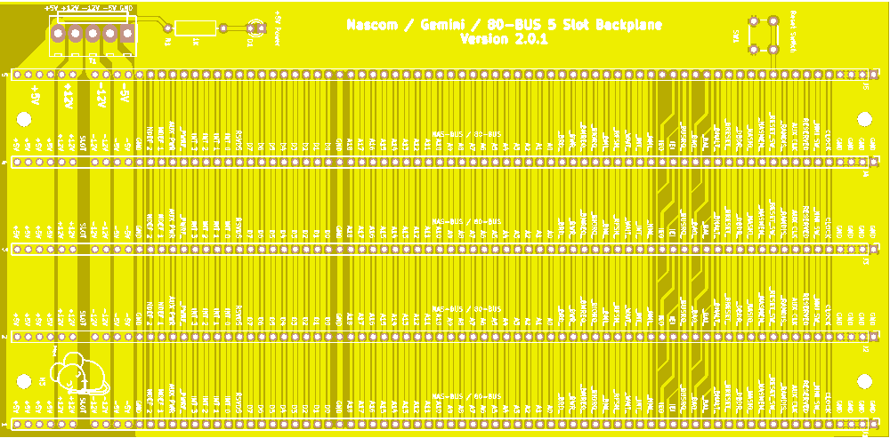

# 5 Slot Backplane

A compact Backplane for Nascom / Gemini / 80-BUS Computers

## Introduction

A new design backplane for Nascom / Gemini / Other 80-BUS Systems

Features

* 5 Slots
* Full interrupt daisy-chaining
* Ground rails between all signals for reliability
* All signal lines clearly labelled
* Pads for Reset switch
* Pads for 5V power indicator
* Pads for Molex KK 396 power connector
* Size 21 x 10 cm (approximately)

